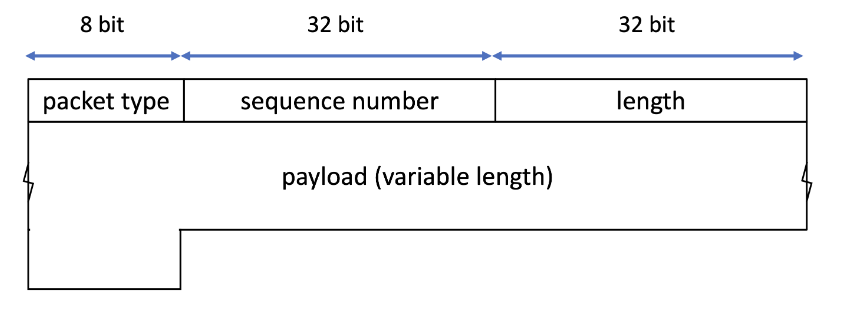

# CS640 Programming Assignment 1: Distributed File Transfer

Due: **Oct 15, 2024**

## Description
For this programming assignment you will write two pieces of code: the "sender" and the "requester". The sender will chunk a requested file and send each file chunk via UDP packets to the requester. The requester will receive these packets, subsequently write it to a file and print receipt information. The file transfer is distributed meaning that the requester may need to connect to different senders to get parts of the file and then assemble these parts to get the whole file. The code must be written in Python3 and must be able to run on the CSL Linux machines. Your code should be able to run both on a single host and on several different hosts.

Details and Requirements
The packets which will be sent are to be of the form:



### Packet type

Valid values for packet type are:

```
'R' (uppercase R), meaning Request packet
'D' (uppercase D), meaning DATA packet
'E' (uppercase E), meaning END packet
```

### Sequence number

* The sequence number is unsigned and must be converted to network byte order while being placed in the packet. Please see Socket DocumentationLinks to an external site.  to find information on using socket.htonl() and socket.ntohl() for conversion from network byte order to host byte order and vice versa.
* For the sender, the sequence number can start at any arbitrary value, as specified by the user in the parameters. The sequence value should increment with the number of "payload" bytes sent during a test. It should not include the 9 bytes required for the header in the packet layout shown above.
* For Request packets, the sequence field is set to 0.

###Length

* The length field is unsigned and specifies the number of bytes carried in the "payload" of the packet.
* In case the packet type is a request, the packet length should be set to 0.

###Payload

* The payload data is chunks from the file that the requester has requested. The sender chunks the file part that it has to payloads of the size that is identified by the length field in its parameters (see below) and sends them to the requester. The last chunk can be of the size less than the length parameter based on how many bytes are left in the file.
* There is no limit on the max size of the payload length.
* The requester fills the payload field with the name of the file that it is requesting.

##Tracker

The tracker is a file (called tracker.txt) that is located in the same folder that the requester resides so that the requester can access it directly. The tracker includes a table that will give the requester enough information to retrieve the file. The table will have the following columns:

**Filename, ID, Sender_hostname, Sender_port, Size**

* The first column is the file name.
* The ID specifies the sequence at which the file parts should be retrieved. For example, the requester should first contact the sender that has ID 1 for the specific file, and then move to the sender that has ID 2 for that file.
* The next 2 fields specify the sender hostname and the port at which it is waiting to receive requests.
* The Size specifies the size of data (in bytes) transmitted by each sender.
* In each row the columns are separated by a single space and the end of each row is specified by an end-of-line character. Make sure that your program reads the correct file format. A sample table is as follows:

```
file1.txt 2 mumble-01 5000 20B
file2.txt 1 mumble-02 5000 15B
file1.txt 1 mumble-03 6000 10B
file1.txt 3 mumble-01 7000 30B
```

Note that 2 senders can be on the same host as long as the port numbers on which they are waiting for requests are different. Each time the requester is run, it refers to this table to figure out where it should retrieve the file from.

## Sender
Each sender will have a copy of the file parts that it is responsible for in the same folder as it is running from, so that it can access them directly. The sender should be invoked in the following way:

```
 python3 sender.py -p <port> -g <requester port> -r <rate> -q <seq_no> -l <length>
```

* port is the port on which the sender waits for requests,
* requester port is the port on which the requester is waiting,
* rate is the number of packets to be sent per second,
* seq_no is the initial sequence of the packet exchange,
* length is the length of the payload (in bytes) in the packets.

###Additional notes for the parameters:

* sender and requester port should be in this range: 2049 < port < 65536
* for implementing the rate parameter the sending interval should be evenly distributed, i.e. when the rate is 10 packets per second the sender has to send one packet at about every 100 milliseconds. It should not send them all in a short time and wait for the remaining time in the second.
* The sender will always send ‘D’ (Data) packets with the same payload length, except for perhaps the last packet of the transfer. If the sender is responsible for 101 bytes of a file and has a length parameter set to 100, the second packet’s payload should just contain the last byte of the file.
* The sender will send an END packet after sending all its data packets.

The sender must print the following information for each packet sent to the requester, with each packet's information in a separate line.

* The time that the packet was sent with millisecond granularity,
* The IP of the requester,
* The sequence number, and
* The first 4 bytes of the payload

## Requester

The requester is invoked in the following way.

```
 python3 requester.py -p <port> -o <file option>
```

* port is the port on which the requester waits for packets,
* file option is the name of the file that is being requested.

The requester must print the following information for each packet that it receives, with each packet's information in a separate line:

* The time at which the packet was received in millisecond granularity,
* Sender's IP address (in decimal-dot notation) and sender’s port number,
* The packet sequence number,
* The payload's length (in bytes)
* (DATA packets only) The percentage of the data received (round to two decimal places), and
* the first 4 bytes of the payload.

After the END packet is received, it should print the following summary information about the test separately for "each" sender:

* Sender's IP address (in decimal-dot notation) and sender’s port number,
* Total data packets received,
* Total data bytes received (which should add up to the file part size),
* Average packets/second, and
* Duration of the test. This duration should start with the first data packet received from that sender and end with the END packet from it.

The requester also should write the chunks that it receives to a file with the same file name as it requested. This new file will be compared with the actual file that was sent out.

## Submission

The executable program names must be "sender.py" and "requester.py".

You may also submit a readme.txt file if you need it.

If you choose to work with a partner, please have only one partner submit your code and include a file named partner.txt in the submission that lists the names and email addresses of both partners. 

It is essential that you follow the required packet format and output specification. Make sure that your program handles getting the inputs from the user correctly. For getting the input parameters, your program should not be looking for a specific order (for example you should not assume that the host number comes before the port number). Moreover, in case a wrong input is entered (e.g., string instead of number) your program should print an error explaining the mistake and exit.

To turn in your code, please submit a .zip file containing sender.py, receiver.py, partner.txt file if applicable, and any other files you wish to submit.

## Important note:

You are responsible to make sure that your code works on the CSL machines before you hand the code in (ssh to these machines and test your code even if you are working in another computer).

Your program will be tested with the requester requesting files and senders sending them to it. Your program should be able to work properly with different parameters that the user specifies (such as the rate, length, ...). Both requester and sender should exit after each run of the tests.

## Grading

Grading will mostly be done by running your code through our set of test cases. To ensure you are graded properly, please adhere to the naming conventions detailed above. The test cases we will be testing for are listed below, along with their weight. We encourage you to write your own testing procedures and perform your own tests, as we will not be publishing our testing scripts. 

```
20 pts: Requesting a file that lives on a single sender that fits in one packet (i.e. the sender’s length parameter is greater than or equal to the file length)
20 pts: Requesting a file that is not split, i.e. lives on a single sender but requires multiple packets to be sent
10 pts: Requesting a file that is split among 2 different senders
  5 pts: Requesting a file that is split among 3 different senders
  5 pts: Requesting a file that is split among 10 different senders
10 pts: Requesting a large file (4kb) that is not split amongst senders
10 pts: Requesting a large file (4kb) that is split among 2 different senders
  5 pts: Requesting a large file (4kb) that is split among 10 different senders
  5 pts: Requesting a file from a sender with a different hostname
```

The final 10 points will be awarded by reading your program output and ensuring the proper fields and reasonable values are being printed.

For each test case, we will check the following aspects with the following weight: 

1. The requester can get the expected file with the correct content. (50 %)
2. The number of packets that the requester receives is correct. It requests that your sender can split and send the file content based on the configured length. (50 %)
